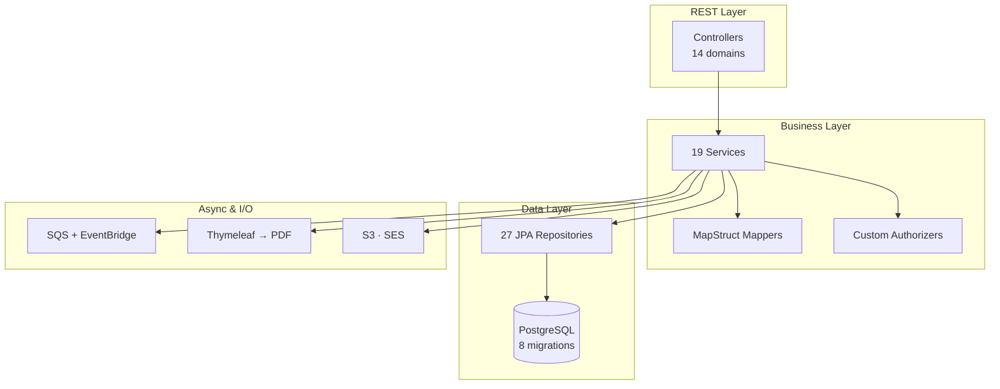

<div align="center">

# GradUp

**Graduate management system for HEI (and can be for others too)** — students, teachers, courses, grades, transcripts & diplomas across the 3-year EL/TN tracks.

[](https://openjdk.org/projects/jdk/21/)
[](https://spring.io/projects/spring-boot)
[](https://neon.tech)
[](docs/TESTING.md)
[](#license)

[Quick Start](#quick-start) · [Docs](#documentation) · [API Reference](doc/api.yml)

</div>

---

## Overview

GradUp is a Spring Boot REST API that manages the full academic lifecycle at HEI: academic years, cohorts, course offerings, exams, grades (with dispute workflow), transcripts and diplomas. Deployed on **[POJA](https://poja.io)** as an AWS Lambda with async processing via SQS/EventBridge.



**Highlights:** OpenAPI-first codegen · domain/JPA separation · event-driven transcript generation · Java 21 virtual threads.

→ Full breakdown in [docs/ARCHITECTURE.md](docs/ARCHITECTURE.md)

## Quick Start

```bash
git clone https://github.com/Mathieu-t790/gradup.git && cd gradup
./gradlew bootRun
```

Set these env vars first — see [docs/DEPLOYMENT.md](docs/DEPLOYMENT.md#environment-variables) for the full list:

```
SPRING_DATASOURCE_URL / _USERNAME / _PASSWORD
```

API docs live at `http://localhost:8080/swagger-ui/index.html` once running.

## Documentation

| | |
|---|---|
| 🏗️ [Architecture](docs/ARCHITECTURE.md) | Design patterns, layering, event flow |
| ✨ [Features](docs/FEATURES.md) | What GradUp does, domain by domain |
| 🔌 [API Reference](docs/API.md) | Key endpoints, roles, [full OpenAPI spec](doc/api.yml) |
| 🗄️ [Database](docs/DATABASE.md) | Schema, migrations, design decisions |
| 🧪 [Testing](docs/TESTING.md) | Test suite, coverage, running tests |
| 🚀 [Deployment](docs/DEPLOYMENT.md) | AWS Lambda setup, env vars, infra |

## Tech Stack

Java 21 · Spring Boot 3.2.2 · Spring Security · PostgreSQL/Flyway · MapStruct · Flying Saucer + Thymeleaf · AWS (Lambda, SES, S3, SQS, EventBridge) · Gradle · JUnit 5 + Testcontainers

## License

Proprietary : © 2026 GradUp contributors. All rights reserved. Open to licensing, partnerships, or acquisition — see [LICENSE](LICENSE).


<sub>Generated from [poja-app/poja-starter-template](https://github.com/poja-app/poja-starter-template)</sub>
