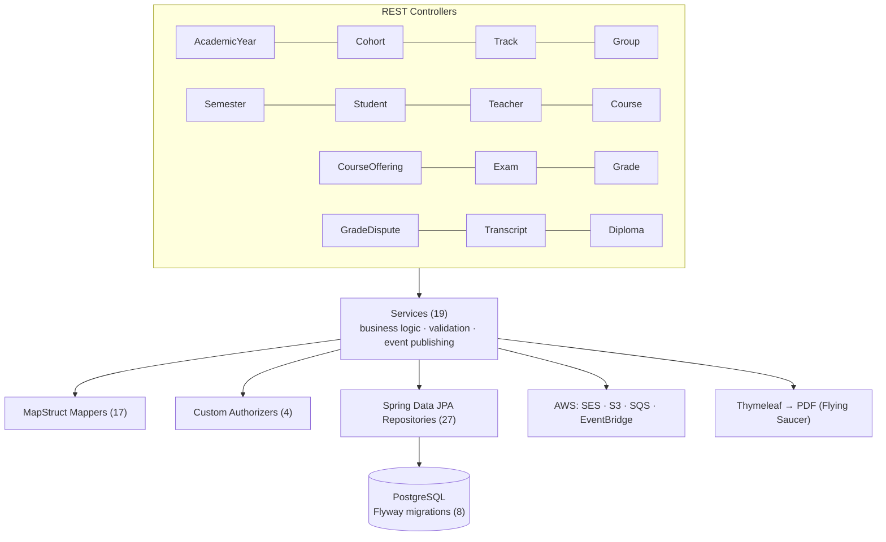

# Architecture

[← Back to README](../README.md)

## Layered view



## Design patterns

- **OpenAPI-first** — REST models are generated from [`doc/api.yml`](../doc/api.yml) via OpenAPI Generator; the spec is the single source of truth.
- **Domain / JPA separation** — pure Java records (`model.*`) for business logic; JPA entities (`repository.model.J*`) for persistence.
- **Custom authorizers** — route-level Spring Security authorization managers: `GradeAuthorizer`, `OfferingAuthorizer`, `StudentAuthorizer`, `OwnerAuthorizer`.
- **Event-driven** — EventBridge + SQS for durable async processing (transcript generation notifications, UUID tracking).
- **Virtual threads** — `Workers.java` dispatches async tasks on Java 21 virtual threads.

## Project structure

```
gradup/
├── doc/api.yml                    # OpenAPI 3.0.3 spec (source of truth)
├── src/main/java/app/mata/gradup/
│   ├── endpoint/rest/controller/  # REST controllers (14 domains + health)
│   ├── endpoint/event/            # EventBridge/SQS producers & consumers
│   ├── security/                  # SecurityConf, authorizers, error handlers
│   ├── service/                   # Business logic (19 services)
│   ├── repository/                # Spring Data JPA (27 repos)
│   ├── model/                     # Domain records (pure Java)
│   ├── mapper/                    # MapStruct mappers (17)
│   ├── mail/ · file/ · handler/   # SES, S3, Lambda handlers
│   └── concurrency/                # Virtual thread workers
├── src/main/resources/db/migration/ # Flyway SQL
└── src/test/java/app/mata/gradup/   # Integration tests (20 classes)
```