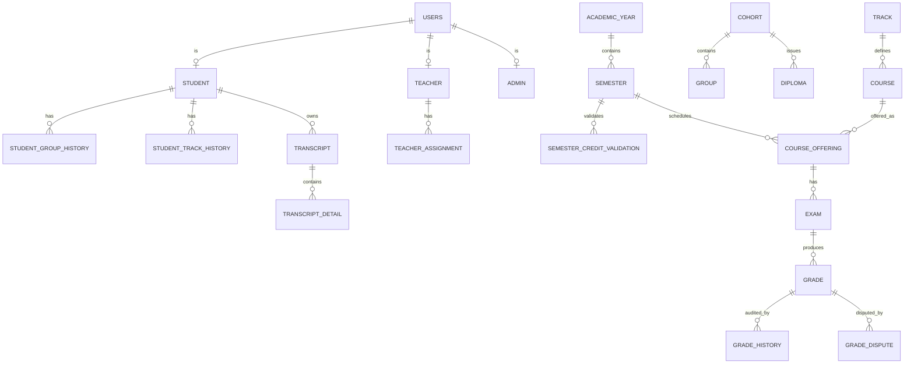

# Database

[← Back to README](../README.md)

PostgreSQL with Flyway-managed migrations in `src/main/resources/db/migration/`.

## Key design decisions

- **Historized tracking** — `student_group_history` and `student_track_history` use `start_date` / `end_date` (`NULL` = current).
- **Grade audit trail** — `grade_history` populated by a DB trigger on `grade.score` UPDATE.
- **UUID primary keys** — all tables use `gen_random_uuid()`.
- **Reference codes** — students `STD\d{5}`, teachers `TCH\d{5}`, admins `ADM\d{5}`.
- **Timestamps** — `TIMESTAMPTZ` everywhere.
- **Frozen scores** — `transcript_detail` freezes scores at PDF generation time.
- **Dispute workflow** — `grade_dispute` is a state machine: `PENDING → REVIEWING → RESOLVED/REJECTED`.